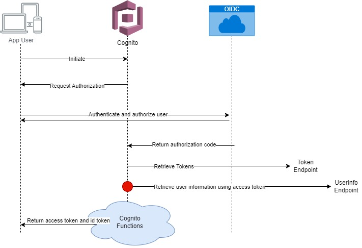

# OIDC user pool IdP authentication flow

## 📖 Description
It describes a authentication flow of cognito with OIDC Provider. All of your custom lambda trigger will be invoked at the point of red dot in below diagram.

Without custom lambda trigger, cognito will as default create user into user pool based on the user information, which is retrieved by OIDC IdP. But with custom lambda triggers, you can validate and update this information before or after integrated steps of cognito.

## 🔍 Assumed Default Core Steps in Cognito
✅ Authenticate Cognito User

✅ Sign Up Cognito User

✅ Generate barer Token

Since I am not developed this service on my own, I cannot gurantee how cognito exactly is implemented in this post. But above 3 steps are tested functions which cognito service does.

Cognito can have two different approaches.
- Loging of New User : Sign Up & Generate Token
- Login of Existing User: Authenticate & Generate Token

✨ For each cognito service steps, you can integrate your own custom lambda trigger to customize the default function of cognito for your usecase specific scenarios.

## 👀 References
1. ☁️ [aws/documentation/cognito](https://docs.aws.amazon.com/cognito/latest/developerguide/cognito-user-pools-oidc-flow.html)