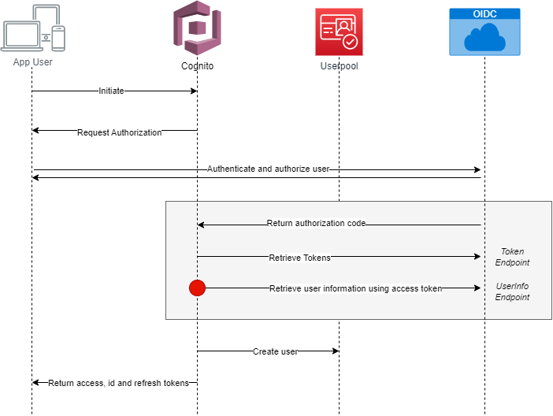
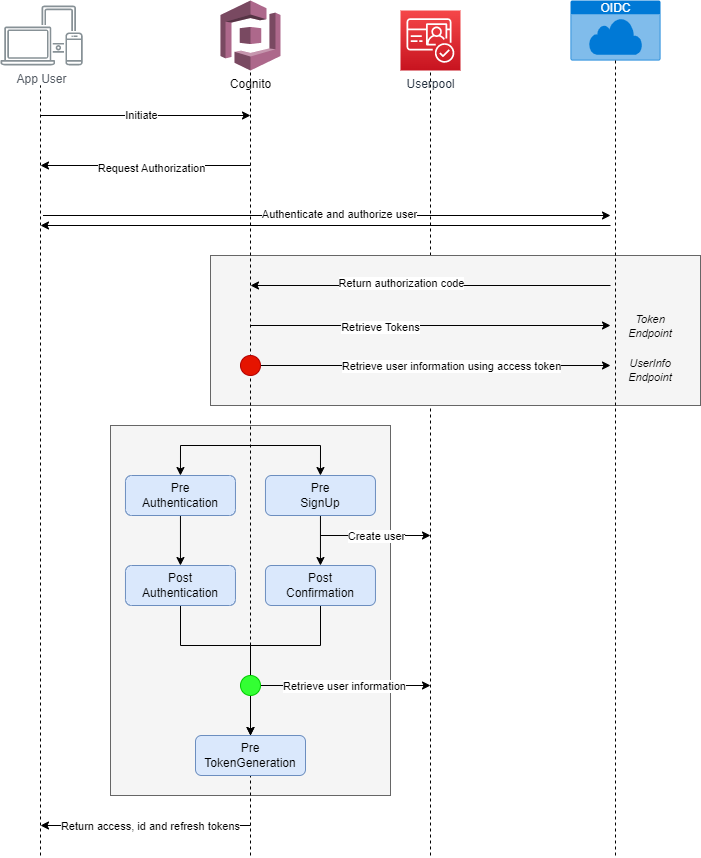
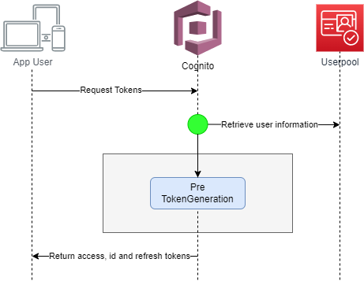

# OIDC user pool IdP authentication flow

## 🚀 Cognito Core Functionalities
✅ Authenticate user with userpool

✅ Sign Up user into userpool

✅ Generate tokens

Depending on existence of the user in cognito userpool, cognito will decide one way to proceed.
- New user: Sign Up & Generate Token
- Existing user: Authenticate & Generate Token

## ✨ Non-Authenticated User (First Login)
For the first login, in order to get tokens from cognito, cognito will first redirect client to OIDC Provider login page to retrieve user information from after sign in. After sign in with OIDC Provider, cognito will send its own tokens back to the client finally.

⚠️ **In this flow, there're two differnt tokens are in place.**
- First token is the token, which cognito will get from OIDC Provider. With this token, cognito can request/retrieve user information. 

- Second token is the token which is issued by cognito. End user will recieve this cognito token and this is most of the cases the key to access to your cloud system from client application.

### 1. Without Lambda Triggers (Default)
Without custom lambda trigger, cognito will as default create user into userpool based on the user information, which is retrieved by OIDC IdP.

### 2. With Lambda Triggers
With custom lambda triggers, you can validate and update the original user information before/after default steps of cognito. Your custom lambda triggers will be invoked **after** cognito gets original user information from OIDC Provider. (Red Dot 🔴)

💡 For each cognito service steps, you can integrate your own custom lambda trigger to customize the default behaviour of cognito for your usecase specific scenarios.

⚠️ **Pre Token Generation Trigger** checks the user information from userpool (Green Dot 🟢), not from original user information which cognito has retrieved (Red Dot 🔴)

## ✨ Authenticated User
In this case, user is already authenticated with OIDC Provider. Authentication flow with OIDC will not be fired and client will get idToken from cognito using access token directly, which is issued by cognito after authentication and is saved in the storage of client browser.

⚠️ **Pre Token Generation Trigger** has the user information from **userpool** (Green Dot 🟢) as input, **not from original user information from OIDC**. It could be different, if your previous trigger functions had updated user information during authentication flow.

## 💯 Summarize
✅ Cognito creates user inside user pool with all mapped information from OIDC Provider.

✅ Lambda trigger funtions can update this information beforehand. 

✅ Lambda trigger functions can add extra validation based on the user information

✅ Pre Token Generation Trigger is the only trigger, which will recieve the user information of userpool. This can lead to problem, if you have updated user information previously using lambda triggers.

✅ After authentication, you won't be able to access the original user information from OIDC. IdToken from cognito contains user information based on current requested cognito userpool user.

## 👀 References
1. ☁️ [aws/documentation/cognito](https://docs.aws.amazon.com/cognito/latest/developerguide/cognito-user-pools-oidc-flow.html)
