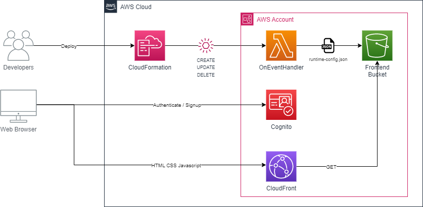
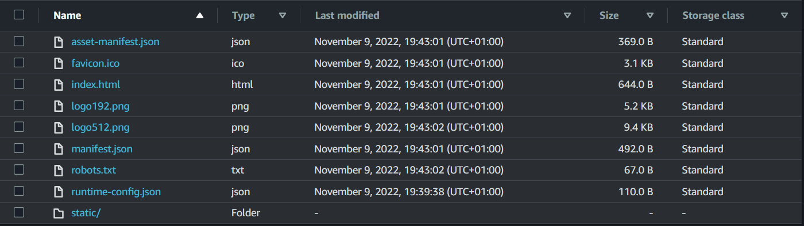

# cognito-react-runtime-config-injection
In **cognito-react-runtime-config** project, I will demonstrate the dynamical way to inject your runtime configuration file to configure your react application with Amplify library to work with AWS Cognito.

## ❤️ Motivation
This project is an improvement of Blog Post from [AWS Community Builders](https://dev.to/aws-builders/implement-auth-in-react-easily-using-aws-cognito-5bhi). I have referenced react application in this project. Actually many of posts, which you could find out, explain you mostly about how to configure serverless web application with amplify library. But none of them explain you how to inject these configuration values to your application. Even not guided in official documentation of [Amplify](https://docs.amplify.aws/lib/auth/getting-started/q/platform/js/#summary) 🤯


## 💡 Description 
Amplify library lets you easily configure with AWS Resources like API-Gateway, Cognito, IoT etc.

This configuration data, however, should not be exposed in any place. Best practice would be reading this datas from your environment variables. There are 3 ways in my mind, which you could follow in your project.

- First appraoch is a common way in DevOps Team, it uses a pipeline to build a react application and inject environment varaibles during `npm run build`

- Second approach is more dynamic and does not require a pipeline to inject environment variables. Web application reads directly the config data from public folder using fetch. In this approach, you can set dynamically your configuration values using **AWS CustomResource Lambda Function**. It can make you provide fully automated SaaS Application to the client. 

- Third approach is also dynamic injection of runtime configuration of the app. It uses but [static-website-constructor from aws-prototyping-sdk](https://aws.github.io/aws-prototyping-sdk/typescript/static-website/index.html). You could of course try it out, but like its naming said, it's **not recommended** for production.

In this project, I will demonstrate the second approach using CustomResource to upload **runtime-config.json** into the hosted S3 Bucket during deployment of the stack. Application will fetch this file during runtime to set values to configure amplify library.

At the end after deployment, your app is ready to serve your clients.


## ✅ Requirements 
* [Git](https://git-scm.com/book/en/v2/Getting-Started-Installing-Git) installed
* [Go](https://go.dev/doc/install) installed
* [Node and NPM](https://nodejs.org/en/download/) installed
* [AWS account](https://portal.aws.amazon.com/gp/aws/developer/registration/index.html)
* [AWS CLI](https://docs.aws.amazon.com/cli/latest/userguide/install-cliv2.html) installed


## ✨ Architecture
Architecture is simple. In this project, I will use cloudfront to let user test on browser after deploymnet, since cloudfront generates a default domain. Cognito Userpool will be used to authenticate the user and let user sign up themselves into the user pool. App is served only for authenticated user and its assets are hosted inside S3 Bucket.



## 🏗️ Principle
1. Cloudformation Stack will be invoked to deploy.
2. CustomResource Lambda will be during stack deployment created and be invoked with Create Event.
3. It reads the parameters which are needed to configure application with amplify library.
4. It uploads **runtime-config.json** file into Frontend Asset Bucket.
5. Rest Frontend Assets will be deployed into S3 Bucket.
6. Web Application reads this generated runtime-config.json during runtime and start communication with cognito.
7. User signup into userpool or authenticate themselves with credentials.
8. After authentication, user can access the content of the application.

As you can see below image, runtime-config.json is created first by OnEventLambda Function in S3 Bucket. Other assets are uploaded afterwards.



### 🌟 Frontend principle
As you can see in **react/src/index.tsx**
```ts
fetch(process.env.PUBLIC_URL + '/runtime-config.json')
  .then((response) => response.json())
  .then((runtimeContext) => {
    Amplify.configure({
      aws_project_region: runtimeContext.region,
      aws_cognito_region:  runtimeContext.region,
      aws_user_pools_id: runtimeContext.userPoolId,
      aws_user_pools_web_client_id: runtimeContext.appClientId, 
    });
    ReactDOM.render(
      <React.StrictMode>
        <ReactNotification />
        <App />
      </React.StrictMode>,
      document.getElementById("root")
    );
  }).catch((e) => console.log(e));
```
Application fetches runtime-config.json dynamically inside the code. It will dynamically update the values too, when there're updates insdie your infrastructure or if you want to deploy the application in various accounts or regions. Your frontend application is **independent** finally from IDs of AWS Resources. 🎉


## 🔥 Deploy

1. Clone the project to your local working directory
```
git clone https://github.com/deloittepark/aws-serverless-golang.git
```

2. Change the working directory to cdk's directory
```
cd cognito-react-runtime-config/cdk
```

3. Install dependencies
```
npm install
```

4. This project uses typescript as client language for AWS CDK. Run the given command to compile typescript to javascript
```
npm run build
```

5. Bootstrap your account with following command
```
npx aws-cdk bootstrap --toolkit-stack-name 'CDKToolkit-Golang-Demo' --qualifier 'demo' --cloudformation-execution-policies 'arn:aws:iam::aws:policy/AdministratorAccess' aws://<YOUR_AWS_ACCOUNT_ID>/<REGION> 
```

6. Synthesize CloudFormation template from the AWS CDK app to validate
```
cdk synth
```

6. Deploy the stack to your default AWS account and region.
```
cdk deploy --require-approval never
```

7. After deployment of the stack, cloudfront domain will be printed as output of stack deployment. You can enter this domain in your browser

## 🚀 Local Test

You can run your application also locally (localhost:3000). But you need to set runtime-config.json in your project manually.

1. Go to S3 Bucket for Frontend Assets. You can refer bucket name from stack deployment output. Or check the output from AWS Console directly.

2. Download runtime-config.json and save it in your public folder.

3. Start your app locally
```
npm run start
```

4. Your app will be hosted in port 3000 with address http://localhost:3000 Your app behaves exactly same like you had tested with Cloudfront Distribution's domain in your browser.


## 🔨 Cleanup

Run the given command to delete the resources that were created. It might take some time for the CloudFormation stack to get deleted. This will delete all deployed resources including cloudwatch lamdba log groups. 🌳🌎🌈

```
cdk destroy
```

## 👀 References

1. [serverlessland](https://serverlessland.com/patterns/lambda-s3-cfn)

2. [cfn-wrapper](https://github.com/aws/aws-lambda-go/tree/main/cfn)

3. [alexdebrie-cloudformation-custom-resources](https://www.alexdebrie.com/posts/cloudformation-custom-resources/)

4. [Amplify runtime-config](https://dev.to/aws-builders/aws-cdk-and-amplify-runtime-config-1md2)

## 💬 Open Discussion
In my opinion, there's a bug in cdk constructor of CustomResource. It creates a lambda log group with INFINITE Retention Period. Since this log group is not part of the stack, stack deletion cannot delete this log group. This log group overwrites the explicitly created log group of the lambda as well. So it causes an error, when you've defined a log group for your lambda function inside your cdk, since the same log group was not deleted, your second deployment will fail, becuase log group already exists. 🤯

As Workaround 🚀 I have resoled issue with attaching policy that OnEvent handler is **not allowed** to create log group implicitly. Log group of the lambda will be created and managed by my infrastructure, not by wrapper function of the constructor. 🔥 

Below is the Snippet of the code, but you can see full code in stack of this project.

```ts
declare const onEvent: lambda.Function;

onEvent.addToRolePolicy(new iam.PolicyStatement({
  actions:['logs:CreateLogGroup'],
  resources:['*'],
  effect: iam.Effect.DENY
}));

new logs.LogGroup(this, 'log-group', {
  logGroupName: `/aws/lambda/${onEvent.functionName}`,
  removalPolicy: RemovalPolicy.DESTROY,
  retention: logs.RetentionDays.ONE_DAY,
})
```

If you are interested to follow the discussion and feature progress, please check out this [issue in GitHub](https://github.com/aws/aws-cdk/issues/21804)


