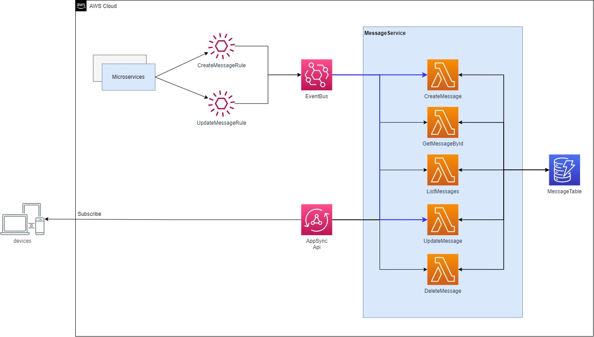

# EventBridge Rule triggers AppSync GraphQl API using API destination + Subscription React Client App

This project contains a sample CDK example for triggering AppSync GraphQl Api using EventBridge Rule. AppSync Api can be invoked from various backend microservices efficiently via EventBus.

 Direct Lambda resolvers are used with Go in AppSync API. Direct Lambda resolvers allows you to write business logic in your preferred language and circumvent the use of VTL.

In the given pattern, AWS AppSync will provide a arguments from context payload to your AWS Lambda function and a default of a Lambda function's response to a GraphQL type. Also eventbus will map incoming event detail to GraphQl Query.

## Requirements

* [Create an AWS account](https://portal.aws.amazon.com/gp/aws/developer/registration/index.html) if you do not already have one and log in. The IAM user that you use must have sufficient permissions to make necessary AWS service calls and manage AWS resources.
* [AWS CLI](https://docs.aws.amazon.com/cli/latest/userguide/install-cliv2.html) installed and configured
* [Git](https://git-scm.com/book/en/v2/Getting-Started-Installing-Git) installed
* [Go](https://go.dev/doc/install) installed
* [Node and NPM](https://nodejs.org/en/download/) installed
* [AWS Cloud Development Kit](https://docs.aws.amazon.com/cdk/latest/guide/cli.html) (AWS CDK) installed

## Architecture
To each Query and Mutation of Graphql in AppSyncApi, one Lambda Resolver is attachted. It handles a business logic of the request.

It's defined as messageService (Microservice) in Go. Each Lambda function has its own and single responsibility to interact with DynamoDB and it returns the reuslt back to AppSyncApi over ResultTemplateMapping. You can trigger AppSync Api destination both from GraphQl Request and EventBridge Rule.

In this project, you can learn both cdk example and go microserivce structure. 




## Deploy

1. Clone the project to your local working directory
```
git clone https://github.com/deloittepark/aws-serverless-golang.git
```

2. Change the working directory to cdk's directory
```
cd eventbridge-appsync-lambda-resolver/cdk
```

3. Install dependencies
```
npm install
```

4. This project uses typescript as client language for AWS CDK. Run the given command to compile typescript to javascript
```
npm run build
```

5. Synthesize CloudFormation template from the AWS CDK app
```
cdk synth
```

6. Deploy the stack to your default AWS account and region. The output of this command should give you the GraphQL URL and API Key for your AppSync API.
```
cdk deploy
```
## Test

You can test your AppSync API and Direct Lambda resolver by running a query from AWS AppSync console.


You can run a query directly from your terminal or via postman:

```
# install curl. https://curl.se/
# optional: install jq. https://stedolan.github.io/jq/
# replace <graphqlUrl> and <apiKey> with the outputs values from `cdk deploy`
curl --location --request POST '<graphqlUrl>' \
--header 'x-api-key: <apiKey>' \
--header 'Content-Type: application/json' \
--data-raw '{"query":"query { listMessages }","variables":{}}' | jq

```

To test invoking AppSync Api using EventBridge Rule, you can send following event payload from AWS EventBridge console.

```
# Create Message Event Payload
{
  "source": "micro.message.create",
  "detail-type": "appsync.mutation.message.create",
  "detail": {
    "topic": "test",
    "text": "test"
  }
}

# Update Message Event Payload
{
  "source": "micro.message.update",
  "detail-type": "appsync.mutation.message.update",
  "detail": {
    "id": "01GF4MF0A13HZ393Z7RDK7KSS1",
    "topic": "test",
    "text": "test"
  }
}
```

## Cleanup

Run the given command to delete the resources that were created. It might take some time for the CloudFormation stack to get deleted. This will delete all deployed resources including cloudwatch lamdba log groups.
```
cdk destroy
```

## References

1. https://serverlessland.com/patterns/eventbridge-appsync-cdk

2. https://aws.amazon.com/blogs/mobile/appsync-eventbridge/

3. https://github.com/aws-samples/aws-global-pubsub-api

4. https://medium.com/nerd-for-tech/create-an-appsync-graphql-gateway-as-a-router-in-gateway-design-pattern-and-strangler-pattern-to-b92d2a2ad5b9
