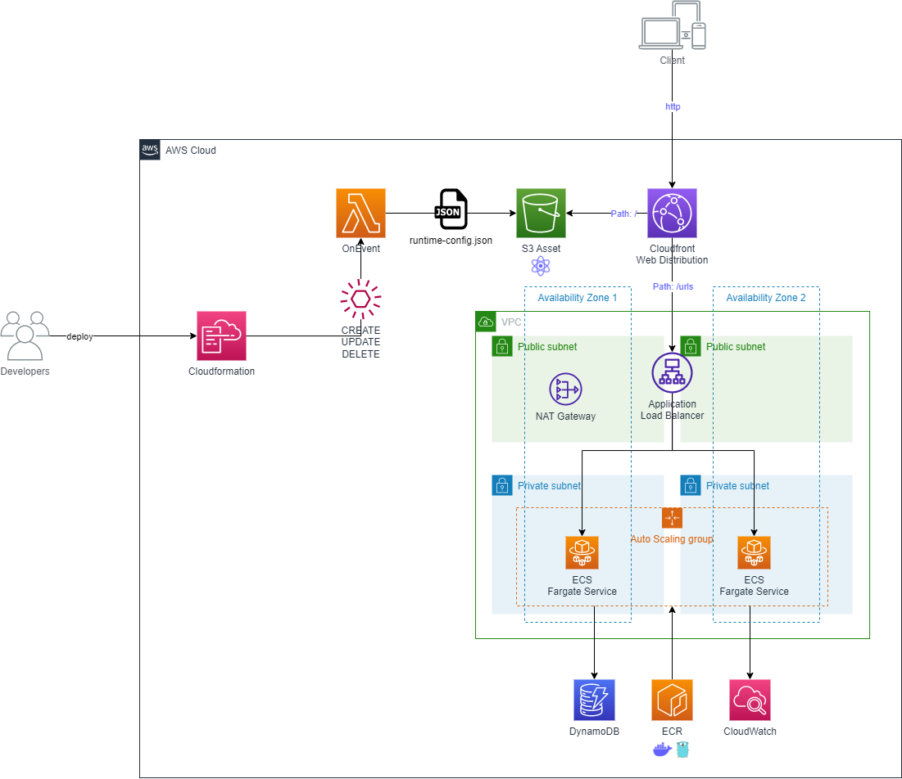

# 🌩️ serverless-web-hosting

In **serverless-web-hosting** project, I will demonstrate two different solutions about hosting web application in AWS Cloud. This project does not cover all necessary points which you might need for your app running on production like Route53, WAF, Cognito etc because of lack of time. It will however give you well defined skeleton of IaC, where you can start with it for your base of your project.

The React Application in this project is based on [url-shotener-frontend-ts](https://github.com/aditya-singh9/url-shotener-frontend-ts). Special thanks to [adity](https://www.adityasingh.tech/) ❤️

## 🎁 On-Premise Example
### ✅ Base Project - dockerized fullstack web application
This base project is a fullstack web application using golang fiber web-framework for api, react application for frontend and DynamoDB for storage. This project can be run using docker and can be hosted in your own server.

### 🔥 Start Application Locally
```
docker compose up
```
- DynamoDB will be hosted in port 8000
- API with go-fiber application will be hosted in port 8080
- React Web Application will be hosted in port 3000

---- 

## 🚀 Migration to AWS Cloud

### ✅ Serverless - ApiGateway + Lambda
First way to migrate is using ApiGateway, Lambda, DynamoDB and Cloudfront. It's very classic way to provision serverless web application in AWS Cloud. ApiGateway has rich features that reduce effort of developers. Developer can fully concentrate on writing business logic in lambda function.

### ✨ Architecture


### ✅ Serverless - ALB + ECS + Fargate
Second and the last way to migrate is using ALB, ECS, Fargate, Dynamodb and Cloudfront. It has advantages that developer can actully ship their container images to AWS Cloud directly without refactoring business logic. It was fast to migrate to AWS using this pattern especially, because our on-premise app was built with Docker container. It has more complexity in Infrastructure and requires fixed amount of cost from NAT Gateway. **But this pattern is highly recommended for big scale web application to handle much bigger traffic than free tier limit.** It will show then extrem differences in cost comparing to ApiGateway approach. 

### ✨ Architecture


## 🤔 Differences?
Yes, from the complexity of the architecture to pricing. Both architecture give you different output. Correct answer does not exist without knowing usecase. But in general, I would love to suggest each pattern for this usecase.

❓ **cost effective + fast development from beginning?**

✅ Go with ApiGateway and Lambda Functions. If you have to deliver this web app in short period time. AND if your traffic is unknown and mostly very smaller at the beginning.

❓ **highly scailable application for big platform?**

✅ ApiGateway and ECS could be used for this case. But in perspectiv of price, apigateway could be way more expensive to handle many traffics. [api-gatway vs alb](https://serverless-training.com/articles/save-money-by-replacing-api-gateway-with-application-load-balancer/)

## 👀 References
1. ☁️ [aws-workshop](https://containers-cdk-react-amplify.ws.kabits.com/)

2. ⚡ [ECS Fargate Application](https://exanubes.com/blog/ecs-fargate-deployment)

3. 🐱‍💻 [url-shotener-frontend-ts](https://github.com/aditya-singh9/url-shotener-frontend-ts)
