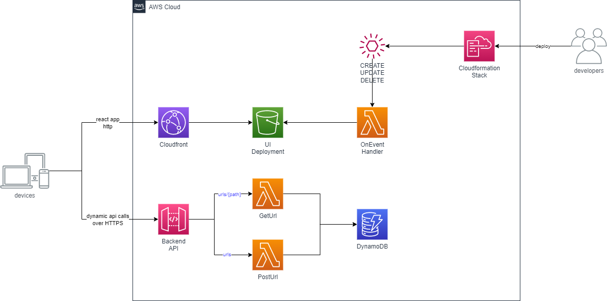

# aws-apigateway-go-lambda-url-shortener
In **apigw-lambda-url-shortener** project, I will demonstrate a small real world example based on the Clean Architecture Project.

This project contains a sample CDK application of ApiGateway, Lambda Functions and DynamoDB. In this example project, you can run same functions that you are going to deploy into aws locally and your functions can also interact with your local DynamoDB.

## 💡 Description 
Usecase of the url shortener is to reaplace original domain to easily typable and user friendly short url, in order to display this url with clients inside/outside of the application.

- First, using POST /urls admin user can generate a simply designed url from original url. And this generated url will be mapped in DynamoDB.

- Second, GET /urls/{{path}} will set the original url into the Locatoin header of the response and returns HTTP Statuscode **307**. Whenever user cliks the fancy url form the application, user will be redirected to the original url.


## ✅ Requirements 
* [Git](https://git-scm.com/book/en/v2/Getting-Started-Installing-Git) installed
* [Go](https://go.dev/doc/install) installed
* [Node and NPM](https://nodejs.org/en/download/) installed
* [NoSQL Workbench](https://docs.aws.amazon.com/amazondynamodb/latest/developerguide/workbench.settingup.html) installed
* [DynamoDBLocal.jar](https://docs.aws.amazon.com/amazondynamodb/latest/developerguide/DynamoDBLocal.DownloadingAndRunning.html) installed

## 🙄 Optoinal 
Since this project can be tested complete locally, AWS is optional in this case. But I recommend to deploy and compare the results on your own.
* [AWS account](https://portal.aws.amazon.com/gp/aws/developer/registration/index.html)
* [AWS CLI](https://docs.aws.amazon.com/cli/latest/userguide/install-cliv2.html) installed

## ✔️ Run Local DynamoDB in Terminal
When you have installed [DynamoDBLocal.jar](https://docs.aws.amazon.com/amazondynamodb/latest/developerguide/DynamoDBLocal.DownloadingAndRunning.html), then I would recommend to save following function in your shell to run local dynamoDB easily.

```
# To Run DynamoDb Local
function dynamo(){
 cd $USER/dynamolocal

 java -Djava.library.path=./DynamoDBLocal_lib/ -jar DynamoDBLocal.jar -sharedDb -port 8000
}
```
Whenever you run **dynamo** in your terminal, it will start to host your local dynamoDB on port 8000.

## ✔️ Set Up DynamoDB Table in NoSQL Workbench
Download the **dynamodb.json** file from **sample_db** and commit it into your localhost.


## ✨ Architecture
Architecture is simple. CDK defines an ApiGateway with single endpoint of **urls**. To this endpoint lambda functions are attached to run business logics with DynamoDB.

Exactly same functionality of this AWS Services, however, can be hosted complete locally via **fiber** and **NoSQL Workbench**. 



## ✨ DynamoDB
DynamoDB Schema is quiet simple. Capability of this table is to hold 1:1 relation between original url and generated short url. As analysis purpose I have added hitCounter attribute, which will be counted up everytime, when user requested to retrieve original url from DynamoDB. Id Key is saved using hashed value in DynamoDB, so there will be only one entry for each url.

### Main Table

### GSI Table 


## 🔥 Deploy

1. Clone the project to your local working directory
```
git clone https://github.com/deloittepark/aws-serverless-golang.git
```

2. Change the working directory to cdk's directory
```
cd apigw-lambda-url-shortener/cdk
```

3. Install dependencies
```
npm install
```

4. This project uses typescript as client language for AWS CDK. Run the given command to compile typescript to javascript
```
npm run build
```

5. Bootstrap your account with following command
```
npx aws-cdk bootstrap --toolkit-stack-name 'CDKToolkit-Golang-Fiber' --qualifier 'demo' --cloudformation-execution-policies 'arn:aws:iam::aws:policy/AdministratorAccess' aws://<YOUR_AWS_ACCOUNT_ID>/<REGION> 
```

6. Synthesize CloudFormation template from the AWS CDK app to validate
```
cdk synth
```

6. Deploy the stack to your default AWS account and region. The output of this command should give you the URL of the ApiGateway, which you can invoke via terminal or Postman
```
cdk deploy --require-approval never
```

7. After deployment of the stack, you can send request to ApiGateway Url, which will be displayed as output of the stack in your console.
## 🚀 Local Test

You can run this services without deploying into AWS Environment complete locally.

1. In your terminal, run **dynamo** or following command, if you haven't set up **dynamo** function in your shell.
```
java -Djava.library.path=./DynamoDBLocal_lib/ -jar DynamoDBLocal.jar -sharedDb -port 8000
```

2. Go to directory api/cmd/getOriginalUrl (It does not matter, in local environment, programm will start all endpoints, which are defined in **router** pacakge)

3. Start your api locally
```
env=local go run main.go
```

4. Import **Postman Collection** to work better. Collection can be found in postman folder of the project.

5. If you want to test the redirection of the browser, please give http://127.0.0.1:8080/urls/:path directly in your browser. You will be redirected to the original URL, which you have created with PostUrl Request.

## 🔨 Cleanup

Run the given command to delete the resources that were created. It might take some time for the CloudFormation stack to get deleted. This will delete all deployed resources including cloudwatch lamdba log groups. 🌳🌎🌈

```
cdk destroy
```

## 👀 References

1. ☁️ [awslabs/aws-lambda-go-api-proxy](https://github.com/awslabs/aws-lambda-go-api-proxy)

2. ⚡ [gofiber](https://github.com/gofiber/fiber)

3. 🐱‍💻 [URL Shortener With Go by Abhishek Gupta](https://betterprogramming.pub/build-a-serverless-url-shortener-with-go-ca198cb4d627)