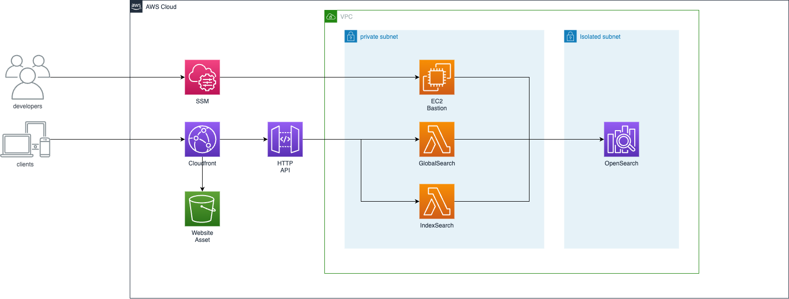

# AWS 🌩️ Opensearch

In **AWS 🌩️ Opensearch** I will demonstrate the beginner edition of using aws opensearch and its integration with web applicatoin.

## ✅ Used AWS Services

🌩️ Lambda Functions

🌩️ HTTP API Gateway

🌩️ S3 Bucket for Website

🌩️ Cloudfront Distributions

🌩️ OpenSearch

🌩️ EC2 Bastion Host

🌩️ SSM

🌩️ VPC

## 💡 Description

Goal of the application is to display the results from opensearch in web application. Web application will call api to retrieve data by query and its results will be displayed in application.

## ✅ Requirements

- [Git](https://git-scm.com/book/en/v2/Getting-Started-Installing-Git) installed
- [Go](https://go.dev/doc/install) installed
- [Node and NPM](https://nodejs.org/en/download/) installed
- [AWS account](https://portal.aws.amazon.com/gp/aws/developer/registration/index.html)
- [AWS CLI](https://docs.aws.amazon.com/cli/latest/userguide/install-cliv2.html) installed

* ⚠️ node version: v18.13.0
* ⚠️ npm version: 9.4.0
* ⚠️ npm version: 9.4.0
* ⚠️ cdk version: 2.113.0
* ⚠️ go version: 1.21
* ⚠️ aws-cli version: /2.12.1

## ✨ Architecture



- HTTP API has two endpoints. search and search/{index}, both endpoints are integrated with lambda function.

- GlobalSearch Lambda function will search the query from opensearch globally, which means it searches the query from all indexes.

- IndexSearch Lambda function will search the query in the index from opensearch, which means it searches the query only in given index.

- Web application is uploaded into S3 bucket and hosted via cloudfront distribution.

- EC2 Bastion host is used to connect with opensearch dashboard locally. Since opensearch is in isolated subnet in aws, it's not available to access over internet.

## 🦄 Reddit Data

In this demo application, I have used Reddit dataset from [kaggle](https://www.kaggle.com/). Example data looks like

```json
{
  "posts": [
    {
      "title": "Which country in the world suffers most from wage inequality and why?",
      "body": "Shall we discuss this topic in the comments? I'm curious to hear your opinions. I have written my own thoughts below.",
      "url": "https://www.reddit.com/r/business/comments/14eeld2/which_country_in_the_world_suffers_most_from_wage/",
      "post_score": 3,
      "comment": "Close your eyes, and you can choose one of the Arab countries that own oil. It will be in the front row. Statistically, I don't have any data. However, I can list the facts that support this idea.",
      "comment_score": 5
    }
  ]
}
```

To upload this data into opensearch, I have implemented converter.go, which transforms this json into bulk type of json to create index in opensearch. Transformed data looks like

```json
{"index":{"_index":"reddit_1"}}
{"title":"Which country in the world suffers most from wage inequality and why?","body":"Shall we discuss this topic in the comments? I'm curious to hear your opinions. I have written my own thoughts below.","url":"https://www.reddit.com/r/business/comments/14eeld2/which_country_in_the_world_suffers_most_from_wage/","comment":"Close your eyes, and you can choose one of the Arab countries that own oil. It will be in the front row. Statistically, I don't have any data. However, I can list the facts that support this idea."}
```

It contains total **6187 posts** of reddit. Bulk upload in opensearch however allows only 10485760 bytes for each api call, which makes me seperate posts into 2 files. bulk_1.json contains first 3000 posts and will be put into reddit_1 index. The other posts will be put into reddit_2 index. (Of course, it does not make sense to seperate the index in this case, but I have created 2 different indexes to demonstrate both index search and global search.)

## 🔥 Deploy

1. Clone the project to your local working directory

```
git clone https://github.com/unitypark/aws-serverless-demos.git
```

2. Bootstrap your account with following command

```
npx aws-cdk bootstrap --toolkit-stack-name 'CDKToolkit-Serverless-Demo' --qualifier 'demo' --cloudformation-execution-policies 'arn:aws:iam::aws:policy/AdministratorAccess' aws://<YOUR_AWS_ACCOUNT_ID>/<REGION>
```

4. Change the working directory to cdk folder and run cdk deploy

```
cdk deploy --all --require-approval never
```

After deployment, cdk will print out **EC2 Bastion Host id, Cloudfront distribution id, API Endpoint, Opensearch domain endpoint, and website bucket name**.

🔥 **First deployment takes between 1608 and 2868 seconds.**

5. Go back to scripts folder and run upload script for web application

```
chmod +x deploy_website.sh && ./deploy_website.sh '<WEBSITE_BUCKET_NAME>' '<DISTRIBUTION_ID>' '<API_DOMAIN>'
```

6. After deployment, open the distribution domain from output of cdk deployment.

## 📜 How To Guide - Setting up opensearch index

1. Run following command to start your session with opensearch via Bastion host.

```
aws ssm start-session --target <EC2-INSTANCE-ID> --document-name AWS-StartPortForwardingSessionToRemoteHost --parameters '{"portNumber":["443"],"localPortNumber":["8157"], "host":["<OPENSEARCH_DOMAIN>"]}'
```

2. Go to data folder and uploading bulk_1.json and bulk_2.json to opensearch.

```
curl -XPOST -u 'admin:<MASTER_USER_PASSWORD>' 'https://localhost:8157/_bulk' --insecure --data-binary @bulk_1.json -H 'Content-Type: application/json'

curl -XPOST -u 'admin:<MASTER_USER_PASSWORD>' 'https://localhost:8157/_bulk' --insecure --data-binary @bulk_2.json -H 'Content-Type: application/json'
```

**master user password can be found in secret manager in aws**

## 📜 How To Guide - Accessing opensearch dashboard

1. Run following command to start your session with opensearch via Bastion host.

```
aws ssm start-session --target <EC2-INSTANCE-ID> --document-name AWS-StartPortForwardingSessionToRemoteHost --parameters '{"portNumber":["443"],"localPortNumber":["8157"], "host":["<OPENSEARCH_DOMAIN>"]}'
```

2. In browser, you can open https://localhost:8157/\_dashboards

## 📜 How To Guide - Testing locally

1. Run following command to start your session with opensearch via Bastion host.

```
aws ssm start-session --target <EC2-INSTANCE-ID> --document-name AWS-StartPortForwardingSessionToRemoteHost --parameters '{"portNumber":["443"],"localPortNumber":["8157"], "host":["<OPENSEARCH_DOMAIN>"]}'
```

2. Go to api/cmd/globalSearch folder and start api locally. Api will start in port 8080

```
OPENSEARCH_ENDPOINT='https://localhost:8157'
OPENSEARCH_MASTER_USERNAME='admin'#
OPENSEARCH_MASTER_USER_PASSWORD='<MASTER_USER_PASSWORD>'
go run main.go
```

3. Go to website folder and start react locally

```
REACT_APP_API_DOMAIN='http://localhost:8080' npm start
```

## 🔨 Cleanup

Run the given command to delete the resources that were created. It might take some time for the CloudFormation stack to get deleted. This will delete all deployed resources including cloudwatch lamdba log groups. 🌳🌎🌈

```
cdk destroy --all --require-approval never
```

## 👀 References

☁️ [opensearch-developer-guide](https://docs.aws.amazon.com/opensearch-service/latest/developerguide/indexing.html)

☁️ [or1-instance](https://aws.amazon.com/blogs/aws/introducing-highly-durable-amazon-opensearch-service-clusters-with-30-price-performance-improvement/)
