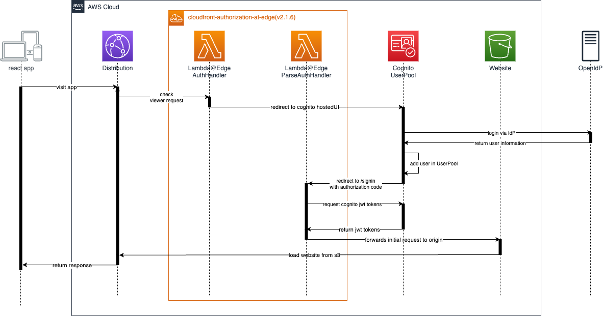
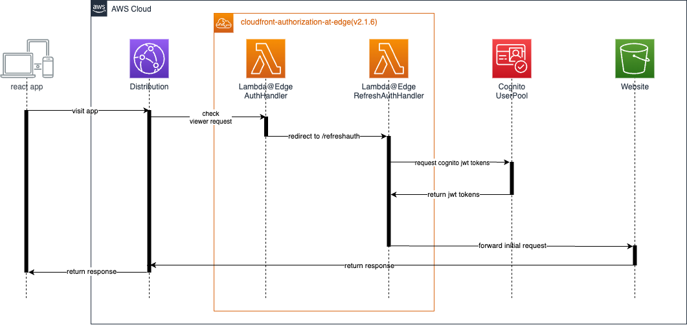
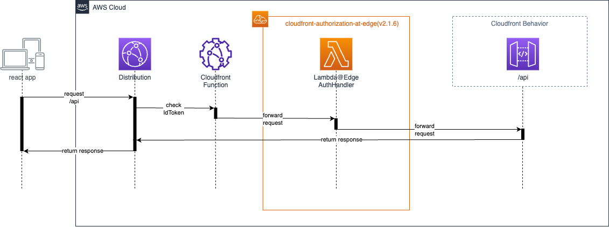
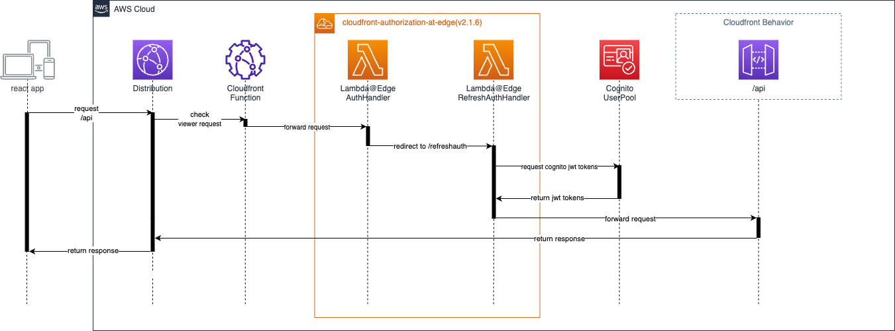
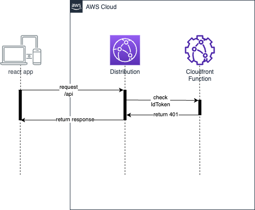
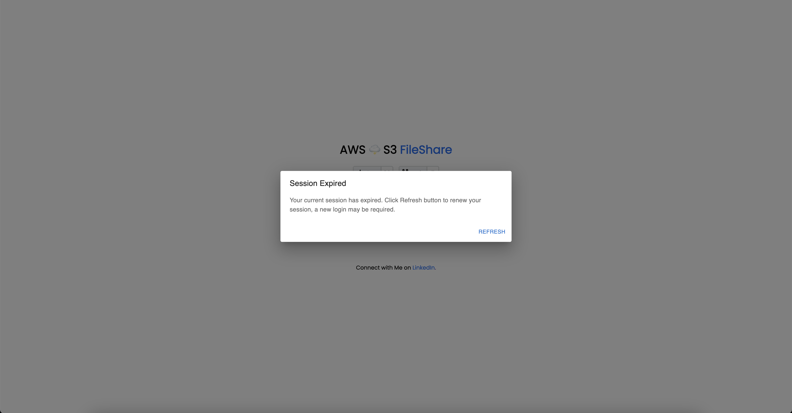

# AWS 🌩️ Serverless Web Application with Cloudfront Authorization@Edge

In **AWS 🌩️ FileShare** project is the extended version of previous project [serverless-file-share-v2](https://github.com/unitypark/aws-serverless-demos/tree/main/serverless-web-hosting/cloudfront-http-api-cognito)
, I will demonstrate a small real world usecase to share your s3 assets using pre-signed url. In addition, this project will show you the best practice example to implement secure **cookie based authentication flow** with cognito and Edge@Lambda function.

## ✅ Used AWS Services

🌩️ Lambda Functions

🌩️ HTTP API Gateway

🌩️ S3 Bucket for Landing Zone Website

🌩️ S3 Bucket for FileShare Service Website

🌩️ S3 Bucket for Shared Files

🌩️ Cloudfront

🌩️ Edge@Lambda

🌩️ DynamoDB

🌩️ Cognito

## 💡 Description

Enterprise customers who host private web apps on Amazon CloudFront may struggle with a challenge: how to prevent unauthenticated users from downloading the web app’s source code (for example, React, Angular, or Vue). This demo app will show guide you the best practice solution to overcome this challenge of customer needs.

We focus on the same use case, sharing an alternate solution that also uses Lambda@Edge and Cognito but is based on HTTP cookies. Using cookies provides transparent authentication to web apps, and also allows you to secure downloads of any content, not just source code.

## ⭐ Overview: Preventing unauthorized content download

Many web apps today are created as a Single Page Application (SPA). A SPA is a single HTML page—index.html—bundled together with JavaScript and CSS. JavaScript is at the core of every SPA, and there are several JavaScript frameworks and libraries to help developers create SPAs, including React, Angular, and Vue.

Companies can choose to host corporate internal SPAs publicly on Amazon CloudFront, using Amazon Simple Storage Service (S3) as the origin. By doing this, companies leverage the advantages of serverless hosting: low costs and no servers to manage. Hosting the app in the cloud also makes it easy for users to access it, especially on a mobile device where they might not be connected to the corporate network. To use the app, they just need internet access.

The downside of publicly hosting an internal SPA is that potential attackers can also download the SPA, not just the intended users. While attackers can’t sign in, they can analyze the source code to learn what the SPA does and which backend API endpoints it connects to. They might even spot a security bug that you’re unaware of.

One common mitigation to thwart analysis of how a SPA works is to obfuscate (“uglify”) the SPA’s source code. The SPA will still run and perform the same tasks but it’s very hard for humans to step through it. However, this is not foolproof security against determined attackers.

In this example, we explore another mitigation: Using Amazon Lambda@Edge to prevent unauthenticated users from even downloading the SPA’s source code. In this solution, we use cookies instead of headers, which makes the functionality transparent to your SPA. Lambda@Edge sets the cookies after sign-in and browsers automatically send the cookies on subsequent requests. That means that the only change you need to make to your SPA is to configure it so that it recognizes the cookies.

In fact, this solution can be used generically to add Cognito authentication to CloudFront web distributions. For example, you can secure CloudFront S3 bucket origins that have private content, such as images.

Reference: [aws-blog-cloudfront-authorization-edge](https://aws.amazon.com/blogs/networking-and-content-delivery/authorizationedge-using-cookies-protect-your-amazon-cloudfront-content-from-being-downloaded-by-unauthenticated-users/)

## 🔥 Goal of the demo project

- How to handle refresh?
- How to handle expired session like expired cookies and refresh
- How to integrate the aws blog solution into your app?
- How to hanlde expired session in frontend?
- Altervative solution of issue (https://github.com/aws-samples/cloudfront-authorization-at-edge/issues/52)
- Altervative solution of issue (https://github.com/aws-samples/cloudfront-authorization-at-edge/issues/190)

## ✅ Requirements

- [Git](https://git-scm.com/book/en/v2/Getting-Started-Installing-Git) installed
- [Go](https://go.dev/doc/install) installed
- [Node and NPM](https://nodejs.org/en/download/) installed
- [AWS account](https://portal.aws.amazon.com/gp/aws/developer/registration/index.html)
- [AWS CLI](https://docs.aws.amazon.com/cli/latest/userguide/install-cliv2.html) installed

* ⚠️ node version: v18.13.0
* ⚠️ npm version: 9.4.0
* ⚠️ npm version: 9.4.0
* ⚠️ cdk version: 2.77.0
* ⚠️ go version: 1.19
* ⚠️ aws-cli version: /2.7.12

## ✨ OAuth2.0

### Authentication Flow for Default (/\*) Origin - Hosting static website over S3

#### 1. Authentication Flow Sequence Diagram with expired session or first login



1. User(Browser) sends requests to domain
2. Viewer Request Edge Lambda checks, if IdToken exists
3. IdToken does not exist, because user's session expired or user signs in to app first time
4. Edge Lambda (checkAuth) redirects user to Cognito HostedUI
5. User enters credentials
6. Cognito sends authorization code back to redirecting endpoint (/signin)
7. Edge Lambda (parseAuth) will generate new cognito JWT token and set them in cookie
8. Edge Lambda (parseAuth) redirects request to initial requested url
9. Origin returns response to cloudfront
10. Cloudfront returns response to browser

#### 2. Authentication Flow Sequence Diagram without valid idToken



1. User(Browser) sends requests to domain
2. Viewer Request Edge Lambda checks, if IdToken exists
3. IdToken exists in request, but it's expired
4. Edge Lambda (checkAuth) redirects user to refresh endpoint of cloudfront(/refreshauth)
5. Edge Lambda (refreshAuth) will issue new cognito JWT access and id tokens using refresh token
6. Edge Lambda (refreshAuth) redirects request to initial requested url
7. Origin returns response to cloudfront
8. Cloudfront returns response to browser

### Authentication Flow for Custom Origin (/api)

#### 1. Authentication Flow Sequence Diagram with valid IdToken



1. User requests to /api endpoint
2. Viewer Request cloudfront function checks, if IdToken exists
3. IdToken exists, then it forwards request to Origin Request Edge Lambda
4. Edge Lambda (checkAuth) validates IdToken and forwards request to Origin
5. Origin returns response to cloudfront
6. Cloudfront returns the response to the browser

#### 2.Authentication Flow Sequence Diagram without valid IdToken



1. User requests to /api endpoint
2. Viewer Request cloudfront function checks, if IdToken exists
3. IdToken exists, then it forwards request to Origin Request Edge Lambda (checkAuth)
4. Edge Lambda (checkAuth) validates IdToken
5. IdToken is not valid, then it forwards request to /refreshauth
6. Edge Lambda (refreshAuth) will issue new cognito JWT access and id tokens using refresh token
7. Edge Lambda (refreshAuth) redirects request to initial requested url with refreshed tokens in cookie header
8. Origin returns response to cloudfront
9. Cloudfront returns the response to the browser

#### 3.Authentication Flow Sequence Diagram with expired session



1. User requests to /api endpoint
2. Viewer Request cloudfront function checks, if IdToken exists
3. IdToken does not exist, then it returns 401 (Unauthorized) response
4. Cloudfront returns the response to the browser
5. Axios in React application will catch 401 in interceptor of axios and show the modal to refresh 
6. User will land to login page and after login will be redirected to the latest page before left

## 🔥 Deploy

1. Clone the project to your local working directory

```
git clone https://github.com/unitypark/aws-serverless-demos.git
```

2. Bootstrap your account with following command

```
npx aws-cdk bootstrap --toolkit-stack-name 'CDKToolkit-Serverless-Demo' --qualifier 'demo' --cloudformation-execution-policies 'arn:aws:iam::aws:policy/AdministratorAccess' aws://<YOUR_AWS_ACCOUNT_ID>/<REGION>
```

3. Bootstrap your account with following command in us-east-1 region for edge lambda

```
npx aws-cdk bootstrap --toolkit-stack-name 'CDKToolkit-Serverless-Demo' --qualifier 'demo' --cloudformation-execution-policies 'arn:aws:iam::aws:policy/AdministratorAccess' aws://<YOUR_AWS_ACCOUNT_ID>/us-east-1
```

4. Change the working directory to scripts's directory

```
cd serverless-web-hosting/cloudfront-authorization-at-edge/scripts
```

5. Run deploy script

```
chmod +x ci.sh && ./ci.sh
```

## 🔨 Cleanup

Run the given command to delete the resources that were created. It might take some time for the CloudFormation stack to get deleted. This will delete all deployed resources including cloudwatch lamdba log groups. 🌳🌎🌈

```
cdk destroy --all --require-approval never
```

## 👀 References

☁️ [cognito-at-edge](https://github.com/awslabs/cognito-at-edge)

☁️ [cloudfront-authorization-at-edge](https://github.com/aws-samples/cloudfront-authorization-at-edge)

☁️ [aws-blog-cloudfront-authorization-edge](https://aws.amazon.com/blogs/networking-and-content-delivery/authorizationedge-using-cookies-protect-your-amazon-cloudfront-content-from-being-downloaded-by-unauthenticated-users/)

☁️ [aws-s3-presigned-url](https://docs.aws.amazon.com/AmazonS3/latest/userguide/using-presigned-url.html)

☁️ [cloudfront-CORS](https://advancedweb.hu/how-cloudfront-solves-cors-problems/)

☁️ [secure-cognito-login-flow](https://advancedweb.hu/how-to-secure-the-cognito-login-flow-with-a-state-nonce-and-pkce/)
