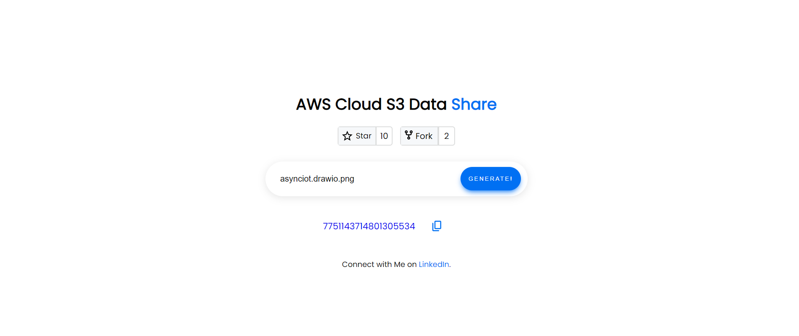
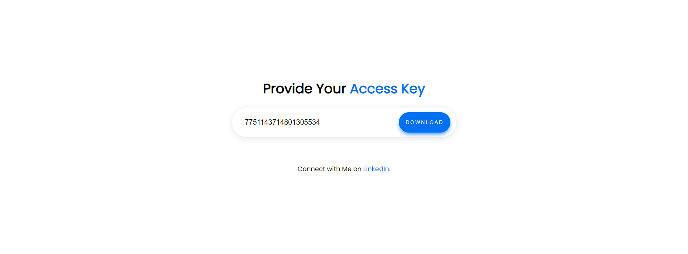
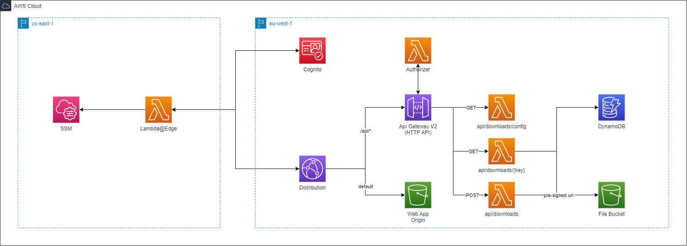

# serverless-file-share-v2
In **serverless-file-share-v2** project is the extended version of previous project [serverless-file-share](https://github.com/unitypark/aws-serverless-demos/tree/main/serverless-web-hosting/cloudfront-rest-api)
, I will demonstrate a small real world example to share your s3 assets using pre-signed url

This project contains a sample CDK application of HttpGateway, Lambda Functions and DynamoDB. For hosting web application, I have used S3 bucket and Cloudfront Distribution. And Cognito with Edge Lambda function for the authentication. In this example project, you can run same functions that you are going to deploy into aws locally and your functions can also interact with your local DynamoDB.

## 💡 Description 
Goal of the file share is to share your assets in s3 with your client in secure way. Many companies have restriction of sharing data via email and email supports upto **25MB**, which is too small for business needs.

Using this application, you could share your assets from your s3 bucket with your client over your web application securely via access key.

- First, using POST /downloads **admin** user can generate an access key and pre-signed url for sharing object. Access key can be used only for one asset. And the presigned url for download has 60 minutes of expiration.

- Second, GET /downloads/{{key}} will return a presigned url, if the access key and its expiration are valid. Then app will download object using returned pre-signed url from s3 bucket. Same Access Key can be used max. 3 times to try to download object.

## 🚀 Application
Application is secured by cognito and api is secured with its idToken. Especially the POST api/downloads is only allowed to admin user. 


This is the main page to generate access key for the file. Only admin user could see this page and call post operation to generate a url for client.


User who wants to access the asset object should provide access key in this text box. Previous copied url contains the access key in path, so the user does not need to do anything, but clicking download button to download asset via pre-signed url.


## ✅ Requirements 
* [Git](https://git-scm.com/book/en/v2/Getting-Started-Installing-Git) installed
* [Go](https://go.dev/doc/install) installed
* [Node and NPM](https://nodejs.org/en/download/) installed
* [NoSQL Workbench](https://docs.aws.amazon.com/amazondynamodb/latest/developerguide/workbench.settingup.html) installed
* [DynamoDBLocal.jar](https://docs.aws.amazon.com/amazondynamodb/latest/developerguide/DynamoDBLocal.DownloadingAndRunning.html) installed

## 🙄 Optoinal 
Since this project can be tested complete locally, AWS is optional in this case. But I recommend to deploy and compare the results on your own.
* [AWS account](https://portal.aws.amazon.com/gp/aws/developer/registration/index.html)
* [AWS CLI](https://docs.aws.amazon.com/cli/latest/userguide/install-cliv2.html) installed

## ✔️ Run Local DynamoDB in Terminal
When you have installed [DynamoDBLocal.jar](https://docs.aws.amazon.com/amazondynamodb/latest/developerguide/DynamoDBLocal.DownloadingAndRunning.html), then I would recommend to save following function in your shell to run local dynamoDB easily.

```
# To Run DynamoDb Local
function dynamo(){
 cd $USER/dynamolocal

 java -Djava.library.path=./DynamoDBLocal_lib/ -jar DynamoDBLocal.jar -sharedDb -port 8000
}
```
Whenever you run **dynamo** in your terminal, it will start to host your local dynamoDB on port 8000.

## ✔️ Set Up DynamoDB Table in NoSQL Workbench
Download the **dynamodb.json** file from **sample_db** and commit it into your localhost.

## ✨ Architecture

- Lambda Edge is supported only in us-east-1 region. That's why we have to create a edge authenticator lambda function in this region. 

- To look up, however, the cognito information, ssm values are stored in us-east-1 region during stack deployment.

- This demo project uses the typescript library [cognito-at-edge](https://github.com/awslabs/cognito-at-edge)

- A Cloudfront distribution has two origins. One is used for http api gateway and the other for web application origin.

- Lambda Authorizer is attached to http apigateway to validate the idToken

- Tokens are provided by Edge@Lambda function after sign in and it's values are saved in browser cookie.

- Web Application will find the idToken, which is generated by Edge@Lambda and use it during current session.

- That's why web application does not need to use of amplify library in client side for authentication.

- Once the user is authenticated via cognito, they can access the api over distribution's domain.


## ✨ DynamoDB
DynamoDB Schema is quiet simple. Capability of this table is to hold 1:n relation between original path and pre-signed url of this asset. 

### Entity Structure

**PK** :Path of asset in s3 bucket

**SK**: ULID

**AccessKey**: Secret key to access pre-signed url of the asset

**CreatedAt**: timestamp of creation time

**ExpiringAt**: timestamp of expiring time (60 min after creation)

**AccessedAt**: accessed timestamp of pre-signed url

**AccessedBy**: cognito user id, who accessed pre-signed url over web application to download the file

**Filename**: Filename of the asset e.g. sample.pdf

**Url**: Pre-signed url


## ✨ API Structure
1. Create Access Key (returns access key)
```
Method: POST
Endpoint: api/downloads
Header: {Authorization: idToken}
Body: {path: 'object_path_in_s3'}
```

2. Get Presigned Url (returns presigned url and filename with extension)
```
Method: GET
Endpoint: api/downloads/<access_key>?id=<user_id>
Header: {Authorization: idToken}
```

3. Get Config - returns user information (username and role)
```
Method: GET
Endpoint: api/downloads
Header: {Authorization: idToken}
```

## 🔥 Deploy

1. Clone the project to your local working directory
```
git clone https://github.com/unitypark/aws-serverless-demos.git
```

2. Bootstrap your account with following command
```
npx aws-cdk bootstrap --toolkit-stack-name 'CDKToolkit-Serverless-Demo' --qualifier 'demo' --cloudformation-execution-policies 'arn:aws:iam::aws:policy/AdministratorAccess' aws://<YOUR_AWS_ACCOUNT_ID>/<REGION> 
```

3. Change the working directory to ci's directory
```
cd serverless-web-hosting/cloudfront-http-api-cognito/ci
```

4. Run deploy script
```
chmod +x deploy.sh && ./deploy.sh <your_aws_profile_in_session_terminal>
```

5. Output will provide you the credentials of the admin user (username = iam) and client user (username=youare), as well as the domain of the cloudfront distribution.

You could login with both credentials, but if you want to generate an access key, you should login with admin credential to the application because of the authorizer.

## 🔨 Cleanup

Run the given command to delete the resources that were created. It might take some time for the CloudFormation stack to get deleted. This will delete all deployed resources including cloudwatch lamdba log groups. 🌳🌎🌈

```
cdk destroy --all --require-approval never
```

## 👀 References

☁️ [cognito-at-edge](https://github.com/awslabs/cognito-at-edge)

☁️ [cloudfront-authorization-at-edge](https://github.com/aws-samples/cloudfront-authorization-at-edge)

☁️ [aws-blog-cloudfront-authorization-edge](https://aws.amazon.com/blogs/networking-and-content-delivery/authorizationedge-using-cookies-protect-your-amazon-cloudfront-content-from-being-downloaded-by-unauthenticated-users/)
