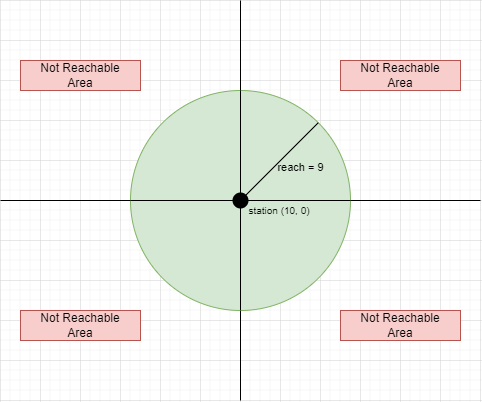
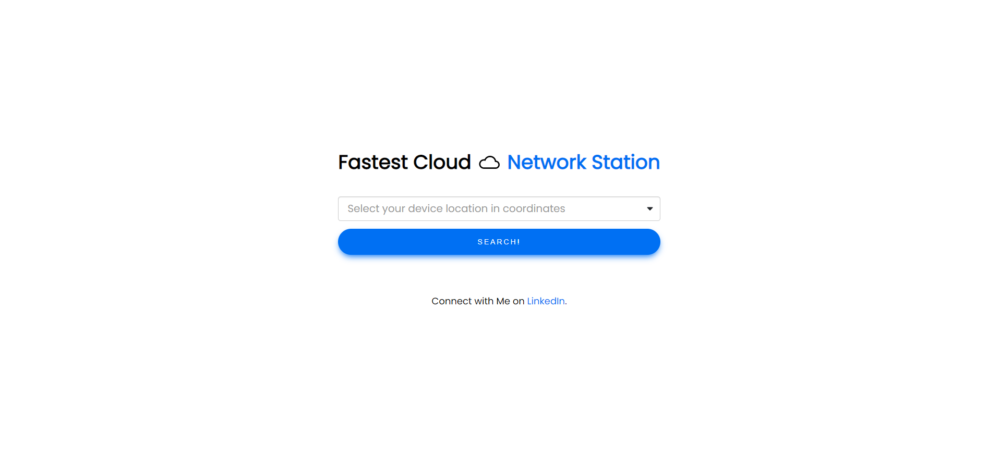
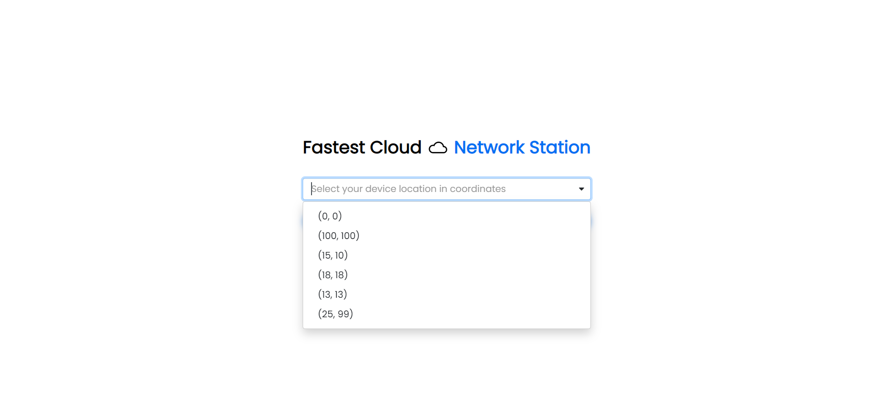
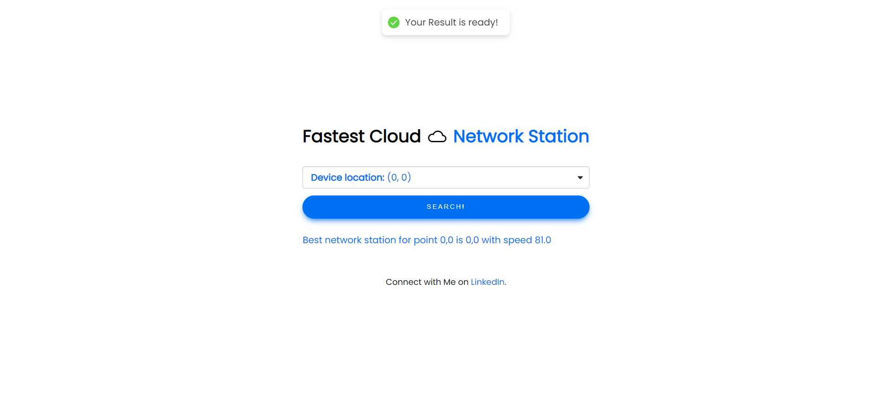
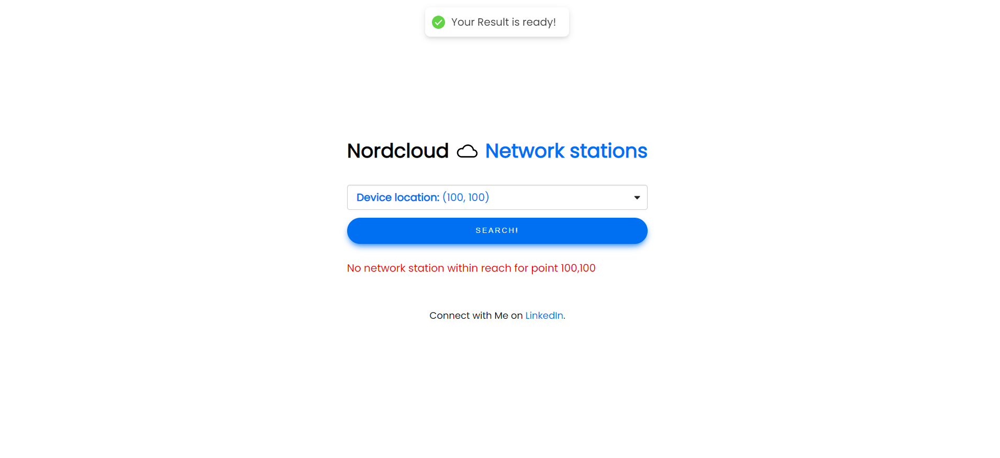
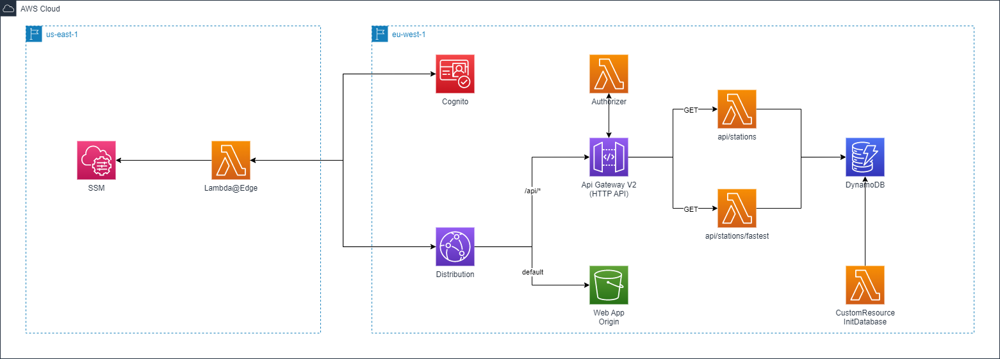

# Fastest Cloud ☁️ <span> Network Station
This project contains a sample CDK application of HttpGateway, Lambda Functions and DynamoDB. For hosting web application, I have used S3 bucket and Cloudfront Distribution. And Cognito with Edge Lambda function for the authentication. 

In this test project, you can run the same application that you are going to deploy into aws locally using **docker compose**.

## 📖 Coding Challenge Task 
Goal of the solution is to provide the fastest and available network station infromation to the client based on client's device location.

### 1. Calculate the distance between station and device
$distance = \sqrt{(x_{station}-x_{device})^2 + (y_{station}-y_{device})^2} $

### 2. Calculate the speed
* If distance > reach, $speed = 0$

* Otherwise, $speed = (reach - distance)^2$

### 3. Given Network Stations (x, y, reach)
- (0, 0, 9)
- (20, 20, 6)
- (10, 0, 12)
- (5, 5, 13)
- (99, 25, 2)

### 4. Given Device Locations (x, y)
- (0, 0)
- (100, 100)
- (15, 10)
- (18, 18)
- (13, 13)
- (25, 99)

## 💡 Idea for search 
From above equation, we could figure out the condition to validate, if a device is **reachable** to station.

For example, we have a station (x,y,reach) = (0,0,9). Then we can calculate the speed with following equation. 

* $speed = (9 - \sqrt{(0-x_{device})^2 + (0-y_{device})^2})^2$

Since $speed = 0$, if $distance > reach$. It means that if the distance is equal or bigger than 9 (reach), then it's **not reachable** to the station.

* $not-reachable \\ = \sqrt{(0-x_{device})^2 + (0-y_{device})^2} \\ = \sqrt{(x_{device})^2 + (y_{device})^2} \\ \geq 9$

This is the equation of the circle, since above condition can be formulated like: 

* $not-reachable \\ = (x_{device})^2 + (y_{device})^2 \\ \geq 81$

Therefore, device must be inside of the station area with reach as radius, so that it could be connected to the station. If the device is near from the station, it will have higher speed.

Below is the diagram to understand the algorithm to define reachable area and not-reachable area. Reachable area is green colored field and outside of the circle is all not-reachable from the station.



## 💡 Algorithm
1. Retrieve all exsting network stations from db.
2. Validate if the device's coordinate is in reachable area of the station.
3. Calculate the speed using given formular.
4. Return the fastest speed and the best station.
```
PROGRAM GetFastestNetworkStation:
  GET all network stations from DB;
  SET maxSpeed to zero
  SET bestStation to empty
  FOR all stations in the list
    IF (device location is in reachable area of station) THEN 
      Calculate speed;
      IF (speed is bigger than maxSpeed) THEN
        SET speed to maxSpeed;
        SET current station to bestStation;
      ENDIF;
    ENDIF;
  ENDFOR;
END.
```

### ✅ What are the differences?
This algorithm will calculate the real distance value, only if the device is in reachable area from network station. For validation, it uses only the square values based on pythagoras theorem. 

$reachable = (x_{station}-x_{device})^2 + (y_{station}-y_{device})^2 < reach^2$, (reach=radius)

If device is in reachable area, then actual distance with square will be calculated to find network speed.

## 🚀 Application
Application is secured by cognito and api is secured with cookie based authorizer. App should have set ***withCredentials=true**, so that cookie will be added into the request header. While server should set **Access-Control-Allow-Credentials: true** and **Access-Control-Allow-Origin=your_domain**. Our app requires CORS header for localhost, since api and app are hosted in another url locally (cross-origin requests), but our application will not encounter any CORS issue, because our frontend and backend are on the same domain using cloudfront behavior.  

### main page


### select device

Devices are saved in app as it's given in assessment. 

### station found

Service found the most fastest station based on device location and it returns a station point and the maximum speed as well as the message which should be displayed to client.

### station not found

Service cannot find the reachable station based on device location and it returnsa message which should be displayed to client.

## ✅ Requirements 
* [Git](https://git-scm.com/book/en/v2/Getting-Started-Installing-Git) installed
* [Docker](https://www.linkedin.com/feed/update/urn:li:activity:6997864787439140864/) installed


## 🙄 Optoinal Requirements
Since this project can be tested complete locally, AWS is optional in this case. But I recommend to deploy and compare the results on your own.
* [AWS account](https://portal.aws.amazon.com/gp/aws/developer/registration/index.html)
* [AWS CLI](https://docs.aws.amazon.com/cli/latest/userguide/install-cliv2.html) installed


## 🚀 Start Application Locally
1. Run docker compose using script
```
chmod +x ./localhost/docker-runner.sh && ./localhost/docker-runner.sh 
```
- DynamoDB will be hosted in port 8000
- API with go-fiber application will be hosted in port 8080
- React Web Application will be hosted in port 3000

2. Initialize your DynamoDB in Docker
```
chmod +x ./localhost/init-db.sh && ./localhost/init-db.sh
```
- This will create a table NetworkStation and seed data of stations provided in assessment test.

3. Open your browser and go to http://localhost:3000

## ✨ Architecture

- Lambda Edge is supported only in us-east-1 region. That's why we have to create a edge authenticator lambda function in this region. 

- To look up, however, the cognito information, ssm values are stored in us-east-1 region during stack deployment.

- This demo project uses the typescript library [cognito-at-edge](https://github.com/awslabs/cognito-at-edge)

- A Cloudfront distribution has two origins. One is used for http api gateway and the other for web application origin.

- Once the user is authenticated via cognito, they can access the api over distribution's domain.

## 🔥 Cookie Based Authorization
The main reason you may want to do this is to add an additional layer of security to your application. In order to set the Authorization header client side with your credentials (usually with a JWT) you need to expose those credentials to the client and therefore risk those credentials being compromised via an XSS attack. Below describes how it could be implemented using Cloudfront, Edge Lambda and API Authorizer.

- Tokens will be provided by Edge@Lambda function after sign in and it's values are saved in cookie with secure setting **(httpOnly=true, secure=true, sameSite=Lax)**.

- Web Application will attach cookies in request header using **withCredentials=true** securely.

- Lambda Cookie Authorizer is attached to http apigateway to validate the idToken from **cookie**.

- In case of **cross-origin requests** between web app and api, api response should contain **Access-Control-Allow-Credentials: true** and **Access-Control-Allow-Origin=your_domain** to prevent CORS error.

## 📚 How CloudFront solves CORS problems
[Tamás](https://www.linkedin.com/in/sallait) has written nice article about CORS and Cloudfront. Shortly, *One domain means easier configuration and better security*
- [how-cloudfront-solves-cors-problems](https://advancedweb.hu/how-cloudfront-solves-cors-problems/)


## ✨ DynamoDB Entity Structure

**ID** :ID of the network station

**Latitude**: X value of station

**Longitude**: Y value of station

**Reach**: Reach value of station


## ✨ API Structure
1. Get all network stations
```
Method: GET
Endpoint: api/stations
Header: {Cookie: cookie value}
Authorizer: CookieAuthorizer
```

2. Get fastest network station information
```
Method: GET
Endpoint: api/stations/fastest?latitude=<pointX>&longitude=<pointY>
Header: {Cookie: cookie value}
Authorizer: CookieAuthorizer
```

## 🔥 Deploy

1. Bootstrap your account with following command in your deploying region
```
npx aws-cdk bootstrap --toolkit-stack-name 'CDKToolkit-Serverless-Demo' --qualifier 'demo' --cloudformation-execution-policies 'arn:aws:iam::aws:policy/AdministratorAccess' aws://<YOUR_AWS_ACCOUNT_ID>/<REGION> 
```

2. Bootstrap your account with following command in us-east-1 region for edge lambda
```
npx aws-cdk bootstrap aws://<YOUR_AWS_ACCOUNT_ID>/us-east-1
```

3. Run deploy script
```
chmod +x ./ci/deploy.sh && ./ci/deploy.sh <your_aws_profile_in_session_terminal>
```

5. It will deploy all resources defined in architecture in your account. Init-Db lambda custom resource will populate the given data into the dynamoDb. 

6. Output will provide you the credentials of the user (username = client) as well as the domain of the cloudfront distribution.

## 🔨 Cleanup

Run the given command to delete the resources that were created. It might take some time for the CloudFormation stack to get deleted. This will delete all deployed resources including cloudwatch lamdba log groups. 🌳🌎🌈

```
cdk destroy --all --require-approval never
```

## 👀 References

☁️ [cognito-at-edge](https://github.com/awslabs/cognito-at-edge)

☁️ [cloudfront-authorization-at-edge](https://github.com/aws-samples/cloudfront-authorization-at-edge)

☁️ [aws-blog-cloudfront-authorization-edge](https://aws.amazon.com/blogs/networking-and-content-delivery/authorizationedge-using-cookies-protect-your-amazon-cloudfront-content-from-being-downloaded-by-unauthenticated-users/)

☁️ [aws-apigateway-lambda-authorizer-blueprints](https://github.com/awslabs/aws-apigateway-lambda-authorizer-blueprints/blob/master/blueprints/go/main.goloaded-by-unauthenticated-users/)

☁️ [aaronosb/cookie-authorizer-example](https://github.com/aaronosb/cookie-authorizer-example)

☁️ [how-cloudfront-solves-cors-problems](https://advancedweb.hu/how-cloudfront-solves-cors-problems/)
