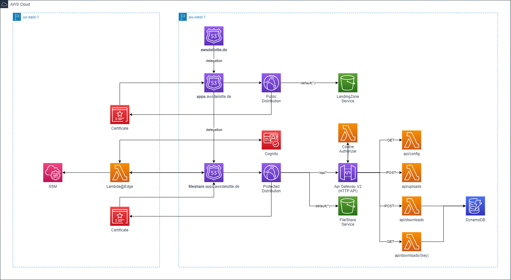
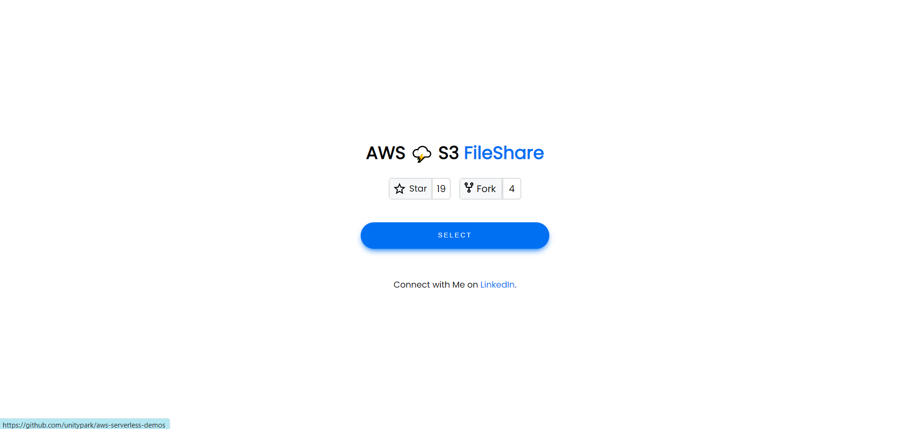
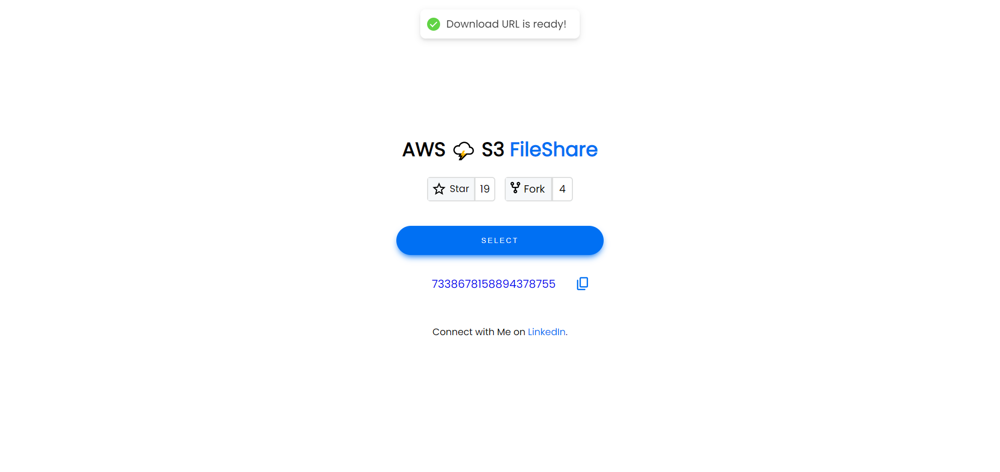

# AWS 🌩️ FileShare
In **AWS 🌩️ FileShare** project is the extended version of previous project [serverless-file-share-v2](https://github.com/unitypark/aws-serverless-demos/tree/main/serverless-web-hosting/cloudfront-http-api-cognito)
, I will demonstrate a small real world usecase to share your s3 assets using pre-signed url. In addition, this project will show you the best practice example to implement secure **cookie based authentication flow** with cognito and Edge@Lambda function.

## ✅ Used AWS Services
🌩️ Lambda Functions

🌩️ HTTP API Gateway

🌩️ S3 Bucket for Landing Zone Website

🌩️ S3 Bucket for FileShare Service Website

🌩️ S3 Bucket for Shared Files

🌩️ Cloudfront Distributions

🌩️ Edge@Lambda - Viewer Request Handler

🌩️ DynamoDB

🌩️ Cognito

🌩️ SSM

## 💡 Description 
Goal of the application is to share your assets in s3 with your client in secure way. Many companies have restriction of sharing data via email and email supports upto **25MB**, which is too small for business needs.

Using this application, you could share your assets from your s3 bucket with your client over your web application securely via access key.

## ✅ Requirements 
* [Git](https://git-scm.com/book/en/v2/Getting-Started-Installing-Git) installed
* [Go](https://go.dev/doc/install) installed
* [Node and NPM](https://nodejs.org/en/download/) installed
* [AWS account](https://portal.aws.amazon.com/gp/aws/developer/registration/index.html)
* [AWS CLI](https://docs.aws.amazon.com/cli/latest/userguide/install-cliv2.html) installed
- ⚠️ node version: v18.13.0
- ⚠️ npm version: 9.4.0
- ⚠️ npm version: 9.4.0
- ⚠️ cdk version: 2.77.0
- ⚠️ go version: 1.19
- ⚠️ aws-cli version: /2.7.12

## ✨ Architecture

- Lambda Edge is supported only in us-east-1 region. That's why we have to create a edge authenticator lambda function in this region. 

- To look up, however, the cognito information, ssm values are stored in us-east-1 region during stack deployment.

- This demo project uses the typescript library [cognito-at-edge](https://github.com/awslabs/cognito-at-edge)

- A Cloudfront distribution has two origins. One is used for http api gateway and the other for web application origin.

- Lambda Authorizer is attached to http apigateway to validate the idToken

- Tokens are provided by Edge@Lambda function after sign in and it's values are saved in browser cookie with **httpOnly** flag.

- Web Application will attach cookie values in request header using **withCredentials** flag securely and send request to API.

- Once the user is authenticated via cognito, they can access the api over distribution's domain.


## ✨ DynamoDB
DynamoDB Schema is quiet simple. Capability of this table is to hold 1:n relation between original path and pre-signed url of this asset. 

### Entity Structure

**PK** :Path of asset in s3 bucket

**SK**: ULID

**AccessKey**: Secret key to access pre-signed url of the asset

**CreatedAt**: timestamp of creation time

**ExpiringAt**: timestamp of expiring time (60 min after creation)

**AccessedAt**: accessed timestamp of pre-signed url

**AccessedBy**: cognito user id, who accessed pre-signed url over web application to download the file

**Filename**: Filename of the asset e.g. sample.pdf

**Url**: Pre-signed get url

3. Get Config - returns user information (username and role)
```
Method: GET
Endpoint: api/downloads
Header: {Authorization: idToken}
```

## 🔥 Pre-Deploy (optional)
1. In Route53, register your domain.
2. Create HostedZone of fileshare.<your_domain> 
3. Add NS values of public hosted zone of your fileshare.<your_domain> into public hosted zone of your domain. **This enables domain delegation.**

## 🔥 Deploy

1. Clone the project to your local working directory
```
git clone https://github.com/unitypark/aws-serverless-demos.git
```

2. Bootstrap your account with following command
```
npx aws-cdk bootstrap --toolkit-stack-name 'CDKToolkit-Serverless-Demo' --qualifier 'demo' --cloudformation-execution-policies 'arn:aws:iam::aws:policy/AdministratorAccess' aws://<YOUR_AWS_ACCOUNT_ID>/<REGION> 
```

3. Bootstrap your account with following command in us-east-1 region for edge lambda
```
npx aws-cdk bootstrap --toolkit-stack-name 'CDKToolkit-Serverless-Demo' --qualifier 'demo' --cloudformation-execution-policies 'arn:aws:iam::aws:policy/AdministratorAccess' aws://<YOUR_AWS_ACCOUNT_ID>/us-east-1
```

4. Change the working directory to scripts's directory
```
cd serverless-web-hosting/serverless-file-share/scripts
```

5. Run deploy script
```
chmod +x ci.sh && ./ci.sh <your_aws_domain>
```
- If you don't provide your domain, cdk will deploy only FileShare service with default distribution domain. It will deploy a landing zone application.

6. After deployment, open the domain from output. 

7. Sign up with your email. It will add user in userpool with default role.

8. If you want to update your role, please go to cognito and update isAdmin attribute to true.

## 📜 How To Guide - Share
1. Open the application domain in browser and sign up to the application


2. **Go to cognito userpool, then update isAdmin field to true to assign an admin role.**

3. In Application, click select button


4. Choose or drag drop your file into the dialog form. *You can attach only **one file** at the same time.*


5. Click submit button in this dialog.   

- ✅ It will request a **presigned put url** of S3 bucket.

- ✅ Then upload your file using this url into S3 bucket.

- ✅ Finally app requests an access key. Lambda function in behind will generate an asset entity in DynamoDB which contains access key, presigned get url etc.

- ⚠️ Depending on the size of your file, it might be able to take some time to upload file into S3 bucket.

- ⚠️ Max 2GB file is allowed for uploading. 

6. Share this url with your client. Client can download your file via download key provided in this url as query parameter.

## 📜 How To Guide - Download
1. Open given URL sent by admin user.

2. Login into the application as client.

3. If client opened the application via given URL, download key is set in input field automatically.


4. Click download button.
- ✅ It will request to retrieve **presigned get url** from DyanmoDB using this access key.

- ✅ Then download the shared file using this url.

- ⚠️ Depending on the size of your file, it might be able to take some time to download file.

- ⚠️ Presigned Get Url is configured with 24 hours of expiring time. 

- ⚠️ This URL can be consumed for upto 100 requests.

## 🔨 Cleanup

Run the given command to delete the resources that were created. It might take some time for the CloudFormation stack to get deleted. This will delete all deployed resources including cloudwatch lamdba log groups. 🌳🌎🌈

```
cdk destroy --all --require-approval never
```

## 👀 References

☁️ [cognito-at-edge](https://github.com/awslabs/cognito-at-edge)

☁️ [cloudfront-authorization-at-edge](https://github.com/aws-samples/cloudfront-authorization-at-edge)

☁️ [aws-blog-cloudfront-authorization-edge](https://aws.amazon.com/blogs/networking-and-content-delivery/authorizationedge-using-cookies-protect-your-amazon-cloudfront-content-from-being-downloaded-by-unauthenticated-users/)

☁️ [aws-s3-presigned-url](https://docs.aws.amazon.com/AmazonS3/latest/userguide/using-presigned-url.html)

☁️ [cloudfront-CORS](https://advancedweb.hu/how-cloudfront-solves-cors-problems/)

☁️ [secure-cognito-login-flow](https://advancedweb.hu/how-to-secure-the-cognito-login-flow-with-a-state-nonce-and-pkce/)
