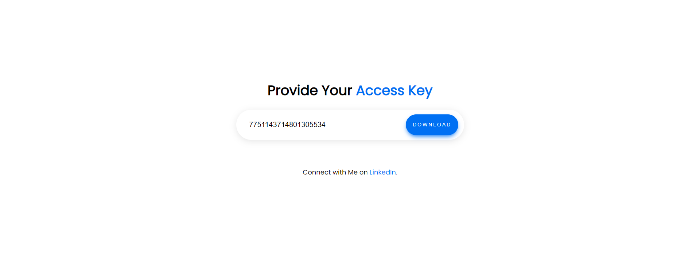
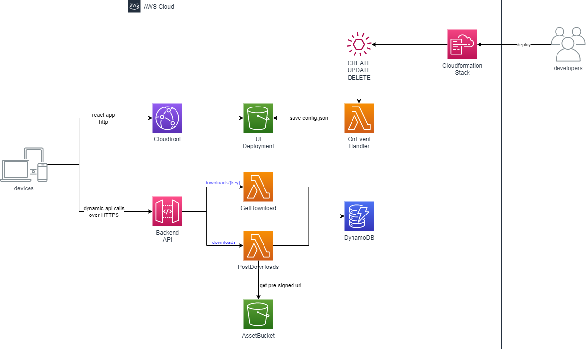

# serverless-file-share
In **serverless-file-share** project, I will demonstrate a small real world example to share your s3 assets using pre-signed url

This project contains a sample CDK application of ApiGateway, Lambda Functions and DynamoDB. For hosting web application, I have used S3 bucket and Cloudfront Distribution. In this example project, you can run same functions that you are going to deploy into aws locally and your functions can also interact with your local DynamoDB.

## 💡 Description 
Goal of the file share is to share your assets in s3 with your client in secure way. Many companies have restriction of sharing data via email and email supports upto **25MB**, which is too small for business needs.

Using this application, you could share your assets from your s3 bucket with your client over your web application securely via access key.

- First, using POST /downloads admin user can generate an access key and pre-signed url for sharing object. Access key can be used only for one asset. And it's url has 15 minutes of expiration and can be invoked only once.

- Second, GET /downloads/{{key}} will return a presigned url, if the access key and its expiration are valid. Then app will download object using returned pre-signed url from s3 bucket. Once it's consumed, then access key will no longer valid.

## 🚀 Application

This is the main page, where admin user could put asset path in text field and generate a url for client. User can click copy clipboard icon and share this url with others.


User who wants to access the asset object should provide access key in this text box. Previous copied url contains the access key in path, so the user does not need to do anything, but clicking download button to download asset via pre-signed url.


## ✅ Requirements 
* [Git](https://git-scm.com/book/en/v2/Getting-Started-Installing-Git) installed
* [Go](https://go.dev/doc/install) installed
* [Node and NPM](https://nodejs.org/en/download/) installed
* [NoSQL Workbench](https://docs.aws.amazon.com/amazondynamodb/latest/developerguide/workbench.settingup.html) installed
* [DynamoDBLocal.jar](https://docs.aws.amazon.com/amazondynamodb/latest/developerguide/DynamoDBLocal.DownloadingAndRunning.html) installed

## 🙄 Optoinal 
Since this project can be tested complete locally, AWS is optional in this case. But I recommend to deploy and compare the results on your own.
* [AWS account](https://portal.aws.amazon.com/gp/aws/developer/registration/index.html)
* [AWS CLI](https://docs.aws.amazon.com/cli/latest/userguide/install-cliv2.html) installed

## ✔️ Run Local DynamoDB in Terminal
When you have installed [DynamoDBLocal.jar](https://docs.aws.amazon.com/amazondynamodb/latest/developerguide/DynamoDBLocal.DownloadingAndRunning.html), then I would recommend to save following function in your shell to run local dynamoDB easily.

```
# To Run DynamoDb Local
function dynamo(){
 cd $USER/dynamolocal

 java -Djava.library.path=./DynamoDBLocal_lib/ -jar DynamoDBLocal.jar -sharedDb -port 8000
}
```
Whenever you run **dynamo** in your terminal, it will start to host your local dynamoDB on port 8000.

## ✔️ Set Up DynamoDB Table in NoSQL Workbench
Download the **dynamodb.json** file from **sample_db** and commit it into your localhost.


## ✨ Architecture
Architecture is simple. CDK defines an ApiGateway with single endpoint of **urls**. To this endpoint lambda functions are attached to run business logics with DynamoDB.

Exactly same functionality of this AWS Services, however, can be hosted complete locally via **fiber** and **NoSQL Workbench**. 



## ✨ DynamoDB
DynamoDB Schema is quiet simple. Capability of this table is to hold 1:n relation between original path and pre-signed url of this asset. 

### Entity Structure

**PK** :Path of asset in s3 bucket

**SK**: ULID

**AccessKey**: Secret key to access pre-signed url of the asset

**CreatedAt**: timestamp of creation time

**ExpiringAt**: timestamp of expiring time (15 min after creation)

**Filename**: Filename of the asset e.g. sample.pdf

**HitCount**: Indicator to observe, if pre-signed url is consumed

**State**: State of pre-signed url, Active/Inactive

**Type**: Type of pre-signed url, Download/Upload

**Url**: Pre-signed url


## 🔥 Deploy

1. Clone the project to your local working directory
```
git clone https://github.com/unitypark/aws-serverless-demos.git
```

2. Change the working directory to cdk's directory
```
cd serverless-web-hosting/serverless-file-share/cdk
```

3. Install dependencies
```
npm install
```

4. Bootstrap your account with following command
```
npx aws-cdk bootstrap --toolkit-stack-name 'CDKToolkit-Serverless-Demo' --qualifier 'demo' --cloudformation-execution-policies 'arn:aws:iam::aws:policy/AdministratorAccess' aws://<YOUR_AWS_ACCOUNT_ID>/<REGION> 
```

5. Build frontend application
```
cd ../ui && npm run build
```

6. Deploy the stack to your default AWS account and region. The output of this command should give you the URL of the ApiGateway, which you can invoke via terminal or Postman
```
cd ../cdk && cdk deploy --require-approval never
```

7. After deployment of the stack, you can send request to ApiGateway Url, which will be displayed as output of the stack in your console.

## ✨ Local Test (optional)
You can run this services without deploying into AWS Environment complete locally.

1. In your terminal, run **dynamo** or following command, if you haven't set up **dynamo** function in your shell.
```
java -Djava.library.path=./DynamoDBLocal_lib/ -jar DynamoDBLocal.jar -sharedDb -port 8000
```

2. Go to directory api/cmd/postDownloads or api/cmd/getDownload

3. Start your api locally
```
go run main.go
```

4. Import **Postman Collection** to work better. Collection can be found in postman folder of the project.

5. If you want to test the redirection of the browser, please give http://127.0.0.1:8080/downloads/:key directly in your browser. You will be redirected to the original URL, which you have created with PostUrl Request.

## 🔨 Cleanup

Run the given command to delete the resources that were created. It might take some time for the CloudFormation stack to get deleted. This will delete all deployed resources including cloudwatch lamdba log groups. 🌳🌎🌈

```
cdk destroy
```

## 👀 References

☁️ [Serverless Land](https://serverlessland.com/patterns/apigw-lambda-s3-cdk-dotnet)
